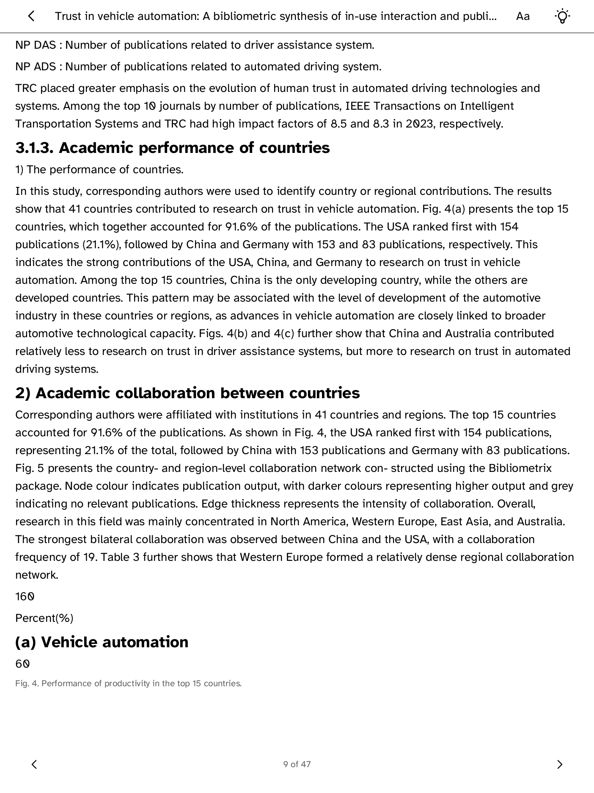

# Cobalt Zotero Reader

Zotero Reader is a read-only Kobo application for a personal Zotero
collection. Save papers from Google Scholar with the Zotero Connector, then
browse the collection, search cached metadata, read abstracts and Zotero
indexed text, and optionally open richer Docling-converted documents through an
owner-operated bridge.

This repository is the app and service workspace extracted from the Cobalt
development branch. It is intentionally separate from the Cobalt platform
pull request: the source can be published, reviewed, and iterated on before
the platform change is accepted. The app is not yet a public Cobalt Store
package.

The image is an owner-provided Kobo device capture from development. It is
evidence of a reading view only, not a simulator, compatibility, or release
claim.

Start with the [reader setup guide](docs/setup.html). If you want structured
PDF conversion, continue with the [self-hosting guide](docs/self-hosting.html).
The same guides are published as a
[GitHub Pages site](https://andreclerigo.github.io/cobalt-zotero-reader/).

## Repository layout

- app/ — Rust application source, model parser, and synthetic Zotero
  fixtures. Copy this directory into a Cobalt checkout as
  examples/zotero-reader/.
- services/zotero-conversion-bridge/ — optional FastAPI, Caddy, and
  Docling deployment.
- docs/index.html — user setup, self-hosting, API, and troubleshooting guides.
- docs/INTEGRATION.md — how this source connects to the Cobalt platform.
- docs/DEVELOPMENT.md — local checks and attended-device workflow.
- docs/ARCHITECTURE.md — trust boundaries and current non-goals.
- docs/screenshots/ — development captures only.

## Architecture

~~~
Google Scholar
      | Zotero Connector
      v
Zotero collection ---> Kobo app ---> metadata and indexed text
      |
      +----------------> optional HTTPS bridge ---> Docling HTML and figures
~~~

The core path talks directly to Zotero Web API v3 and makes no Zotero write
requests. The bridge is optional and is needed for structured PDF conversion
with tables, formulas, OCR, and figures. The app never scrapes Google Scholar
or follows publisher URLs.

## Quick start

Run the bridge checks without an account or deployment:

~~~
cd services/zotero-conversion-bridge
uv sync --frozen --group dev
uv run ruff check .
uv run mypy src
uv run pytest
docker compose config
~~~

Validate the static documentation with:

~~~
python3 scripts/validate_docs.py
~~~

To run the Kobo app, integrate app/ into Cobalt and follow
docs/INTEGRATION.md. Do not place a Zotero key or bridge token in source, a
URL, a shell argument, or this repository.

## Current status

The source is a development snapshot. The current Cobalt integration depends
on the operation-aware credential policy proposed in
Cobalt PR 50: https://github.com/BandarLabs/Cobalt/pull/50, followed by a
separate app integration change. Until those platform changes land, this
repository remains useful for code review, bridge deployment, fixtures, and
host-side development, but it is not a standalone Kobo build.

## License

This project follows Cobalt and is distributed under the GNU Affero General
Public License v3.0. See LICENSE.
